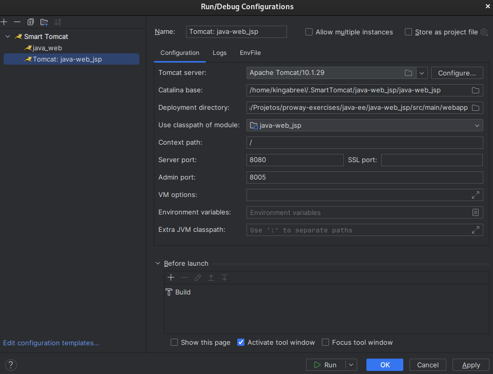
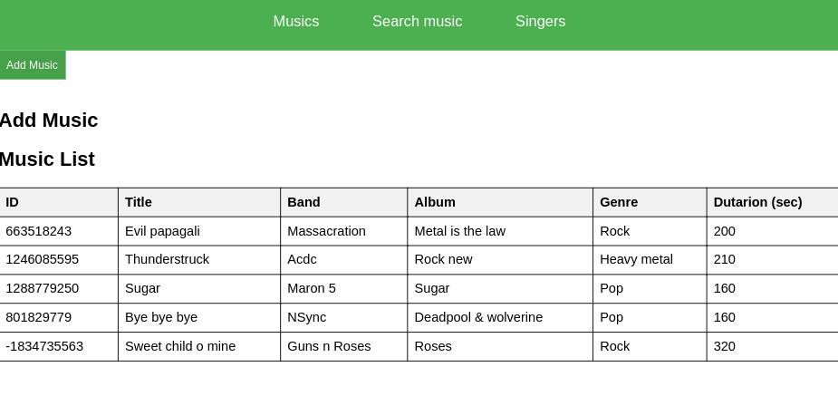
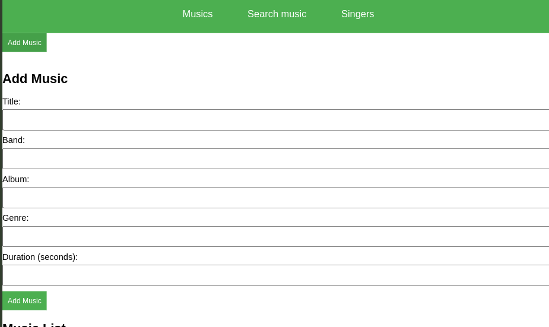
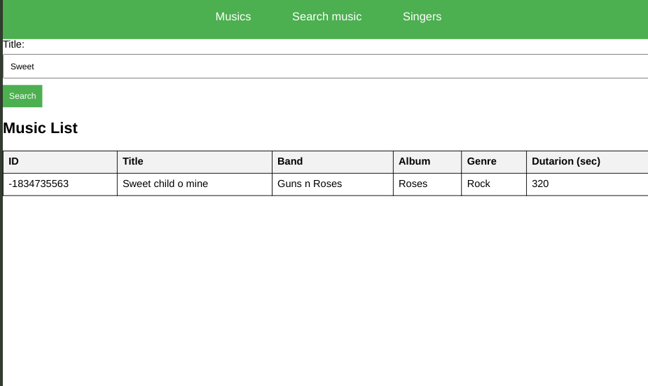
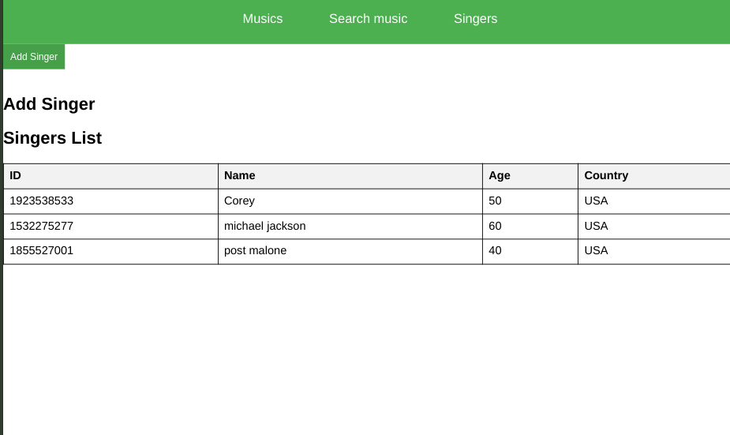

# Music and Singer Management Application
## Objetivo da Aplicação
Esta aplicação Java EE foi desenvolvida para gerenciar músicas e cantores, permitindo a adição de novos registros e a exibição de listas de músicas e cantores. A interface de usuário é feita em JSP, enquanto a lógica de negócios é implementada utilizando servlets que se conectam a um banco de dados.

## Modelagem
A aplicação possui duas entidades principais:

1. Music: Representa uma música, com informações como título, banda, gênero, duração e álbum.
2. Singer: Representa um cantor, armazenando dados como nome, idade e país.
Essas entidades estão modeladas em classes Java dentro do pacote model e são manipuladas através de DAOs (Data Access Objects) para interação com o banco de dados.

## Estrutura do Projeto
```
src/
└── main/
    ├── java/
    │   ├── dao/
    │   │   ├── MusicDao.java
    │   │   └── SingerDao.java
    │   ├── db/
    │   │   └── DbConnect.java
    │   ├── model/
    │   │   ├── Music.java
    │   │   └── Singer.java
    │   └── student.com.servlet/
    │       ├── MusicServlet.java
    │       ├── SearchServlet.java
    │       └── SingerServlet.java
    ├── resources/
    └── webapp/
        ├── css/
        │   └── musicStylePage.css
        └── WEB-INF/
            ├── web.xml
            └── JSP/
                ├── header.jsp
                ├── index.jsp
                ├── music.jsp
                └── singer.jsp

```

## Como iniciar
### Requisitos
- Java
- Apache Tomcat
- Banco de dados
- Instalar as dependências com o comando:
```bash 
mvn install
```
### Passo a passo
1. Clonar o repositório com o comando:
```bash 
git clone https://github.com/kingabreel/java-ee_web-app.git
```
2. Criar as tabelas no banco de dados para as entidades cantor e música:
```postgresql
CREATE TABLE music(
    id int primary key,
    title varchar,
    band varchar,
    genre varchar,
    durationSec int,
    album varchar
);

CREATE TABLE singer (
    id int primary key,
    name varchar,
    age int,
    country varchar
);
```
3. Configurar o TomCat na IDE

4. Iniciar o programa e acessar o link fornecido no terminal

## Imagens do projeto




